# Healthcare Management System 

**Course:** CSE 731 - Software Testing  
**Term:** Term I 2025-26  
**Project Type:** Mutation Testing 

## Team Members

| Name          | Roll Number  |
|---------------|--------------|
| Abhishek Sahu | MT2024007    |
| Ankur Sinha   | MT2024023    | 

---

**GitHub Repository:** [https://github.com/ankur7470/healthcare-system](https://github.com/ankur7470/healthcare-system)

---

## 1. Introduction to Mutation Testing

### What is Mutation Testing?

Mutation testing is a structural testing method aimed at assessing and improving the adequacy of test suites. It evaluates the quality of tests by introducing small intentional changes (mutations) into the program source code and checking if the test suite can detect these changes.

### How Mutation Testing Works

The mutation testing process follows these steps:

1. **Introducing Faults:** Minor changes are made to the program's source code to create mutants. Examples include:
   - Replacing `+` with `-` in arithmetic expressions
   - Changing `>` to `>=` in boundary conditions
   - Inverting boolean conditions
   - Replacing return values with null/false/true

2. **Test Application:** Test cases are executed against both the original code and the mutated program versions.

3. **Mutation Killing:** If test results differ between original and mutated code, the mutant is considered "killed" (detected), indicating effective test cases.

4. **Analysis:** If tests cannot detect the mutation, it suggests insufficient test sensitivity and the need for improved test cases.

---

## 2. Project Overview

### Healthcare Management System

A comprehensive command-line Java application for managing healthcare operations including:

- **Patient Management:** Registration, record management, search functionality
- **Doctor Management:** Doctor profiles, specialization tracking, availability management
- **Appointment Scheduling:** Schedule, reschedule, cancel, and complete appointments
- **Prescription Management:** Create prescriptions with medications, track validity
- **Medical Records:** Maintain patient medical history with diagnosis and treatment details

### Source Code Statistics

- **Total Lines of Code:** 1,000+ lines (excluding documentation and test files)
- **Number of Classes:** 17 (5 models, 5 services, 5 repositories, 2 utilities)
- **Number of Test Classes:** 7
- **Total Test Cases:** 260+
- **Repository Structure:** Maven-based Java project

---

## 3. Tools and Technologies Used

### Build Tool
- **Maven 3.11.0** - Project build and dependency management

### Testing Framework
- **JUnit 5 (Jupiter)** - Unit testing framework
- **JUnit 5 Parameters** - Parameterized test support

### Mutation Testing
- **PIT (Pitest) 1.14.2** - Mutation testing engine
- **PIT Maven Plugin 1.14.2** - Maven integration for PIT
- **PIT JUnit5 Plugin 1.2.0** - JUnit5 support for PIT

### Java Development
- **Java 11** - Target platform
- **Apache Maven 3.6.0+** - Build system

---

## 4. Project Folder Structure

### Complete Project Directory Layout

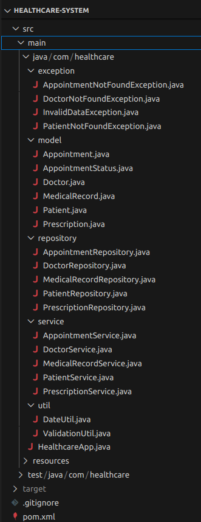

**Figure 1:** Complete project structure showing all packages and files organized in Maven format.

### Test Classes Organization

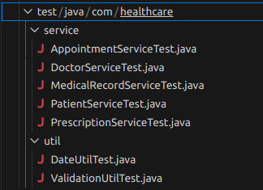

**Figure 2:** Test classes directory structure with 7 comprehensive test suites for service and utility classes.

---

## 5. Maven Configuration

### 5.1 JUnit 5 Dependencies

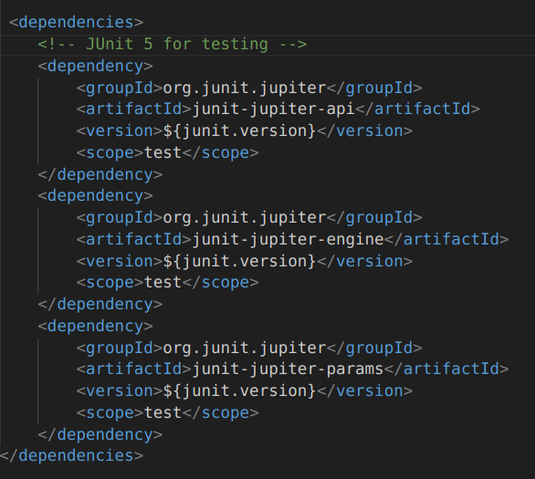

**Figure 3:** Maven POM dependencies for JUnit 5 framework including Jupiter API, Engine, and Parameters modules for parameterized testing.

### 5.2 PIT Mutation Testing Plugin Configuration

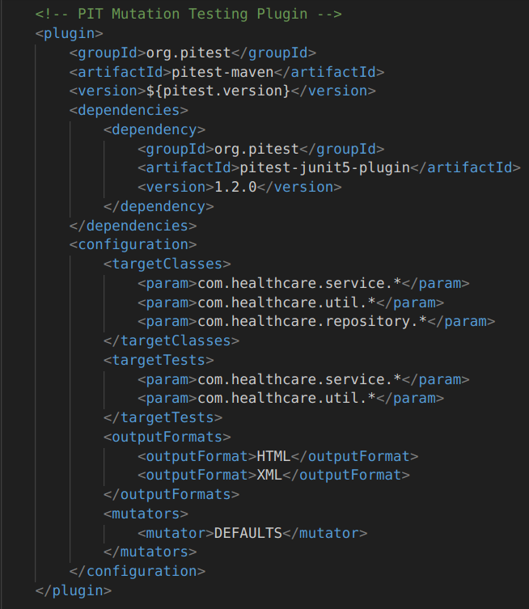

**Figure 4:** Maven PIT plugin configuration showing mutation testing setup with target classes, test classes, output formats, and mutator specifications.

---

## 6. Mutation Testing Strategy

### Unit-Level Mutation Operators

The following mutation operators are applied at the method/statement level:

1. **CONDITIONALS_BOUNDARY** - Modifies boundary conditions (e.g., `>` → `>=`, `<` → `<=`)
2. **EMPTY_RETURNS** - Modifies return statements to return empty/default values
3. **FALSE_RETURNS** - Changes return values to `false`
4. **TRUE_RETURNS** - Changes return values to `true`
5. **PRIMITIVE_RETURNS** - Modifies primitive return values
6. **NULL_RETURNS** - Changes return values to `null`
7. **NEGATE_CONDITIONALS** - Negates conditional statements (inverts logic)
8. **INCREMENTS** - Modifies increment operators (`++` → `--`)
9. **MATH** - Changes mathematical operators (`+` → `-`, `*` → `/`)
10. **INVERT_NEGS** - Inverts negative numbers
11. **VOID_METHOD_CALLS** - Removes void method calls

### Integration-Level Mutation Operators

The following mutation operators are applied at the integration level:

1. **NON_VOID_METHOD_CALLS** - Affects method interactions and return value handling
2. **EXPERIMENTAL_ARGUMENT_PROPAGATION** - Affects method parameter passing
3. **EXPERIMENTAL_NAKED_RECEIVER** - Impacts object interactions
4. **REMOVE_CONDITIONALS** - Can affect program flow across component boundaries

---

## 7. Test Case Design

### Testing Strategy

**Comprehensive Unit Testing with Edge Cases:** All services and utilities are tested with:

- Valid input tests
- Invalid/null input tests
- Boundary condition tests
- State transition tests
- Integration tests between services

### Test Coverage Summary

| Component | Test Class | Test Cases | Focus Area |
|-----------|-----------|-----------|-----------|
| PatientService | PatientServiceTest.java | 42 | CRUD operations, validation |
| DoctorService | DoctorServiceTest.java | 37 | Doctor management, availability |
| AppointmentService | AppointmentServiceTest.java | 28 | Scheduling, status changes |
| PrescriptionService | PrescriptionServiceTest.java | 20 | Prescriptions, medications |
| MedicalRecordService | MedicalRecordServiceTest.java | 23 | Medical history, records |
| ValidationUtil | ValidationUtilTest.java | 70 | Input validation |
| DateUtil | DateUtilTest.java | 47 | Date/time operations |
| **Total** | | **260+** | |

### Test Execution Command

```bash
# Run all unit tests
mvn clean test

# Run specific test class
mvn test -Dtest=PatientServiceTest

# Run with coverage output
mvn test -Dtest=*ServiceTest
```

### Unit Test Execution Results

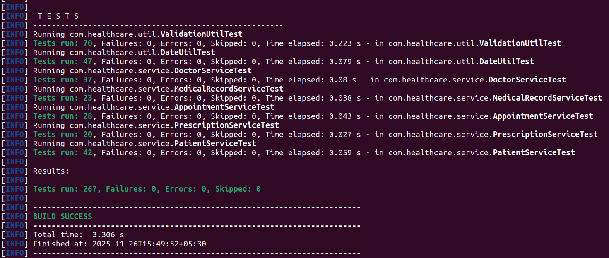

**Figure 5:** Complete unit test execution showing all 260+ tests passing with 0 failures. Test execution time and breakdown by test class are displayed.

---

## 8. Mutation Testing Execution

### Running Mutation Tests

#### Command to Execute PIT:

```bash
mvn org.pitest:pitest-maven:mutationCoverage
```

#### Alternative Shorthand:

```bash
mvn pitest:mutationCoverage
```

#### Mutation Testing Execution Output

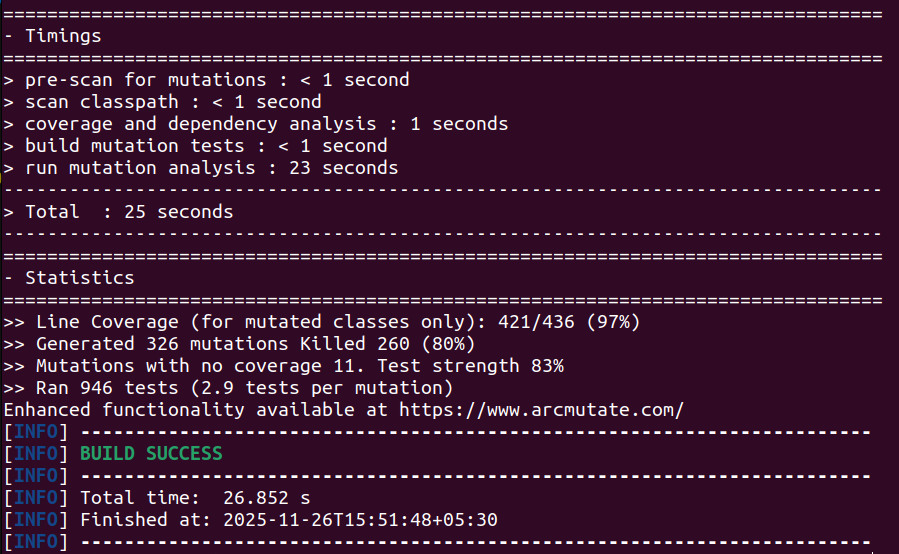

**Figure 6:** PIT mutation testing execution showing mutation generation, test application, and final statistics. Displays mutation count, killed mutants, and execution timing information.

---

## 9. Mutation Testing Results

### Project Summary Report

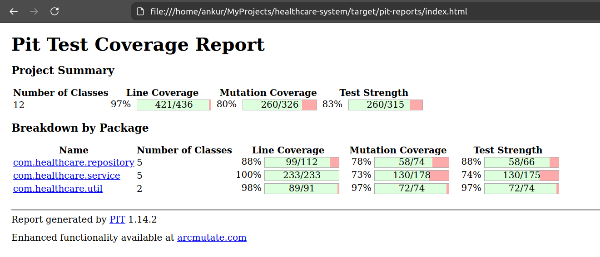

**Figure 7:** Project summary showing overview of mutation testing

### Service Layer Mutation Analysis

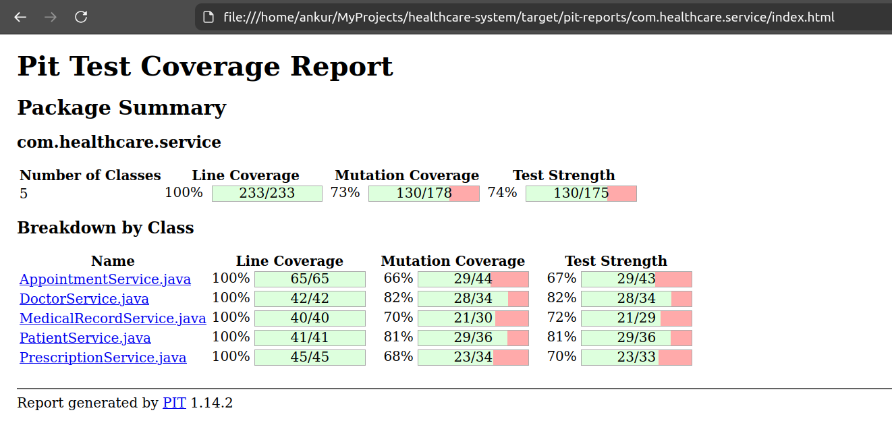

**Figure 8:** Detailed mutation analysis for `com.healthcare.service` package showing 5 service classes with individual mutation coverage metrics.

### Repository Layer Mutation Analysis

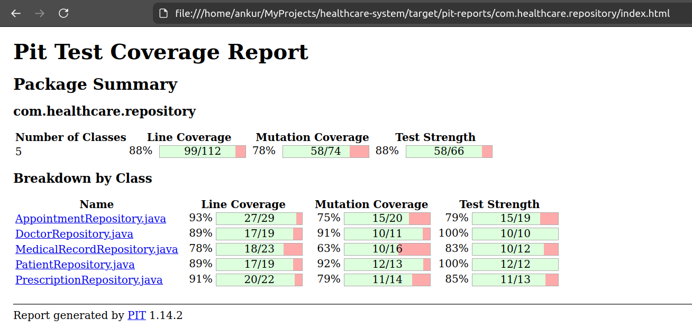

**Figure 9:** Repository layer mutation coverage for `com.healthcare.repository` package including 5 repository implementations with their respective mutation metrics.

### Utility Classes Mutation Analysis

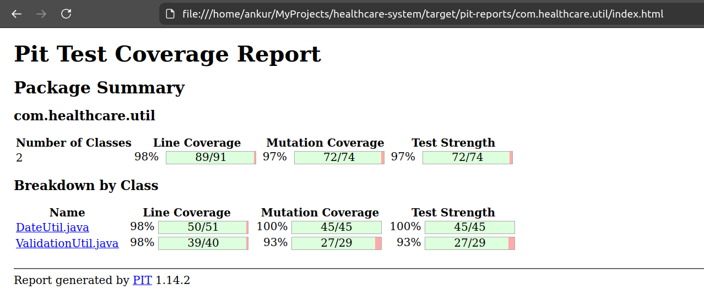

**Figure 10:** Utility classes mutation testing for `com.healthcare.util` package.

### List of Active Mutators

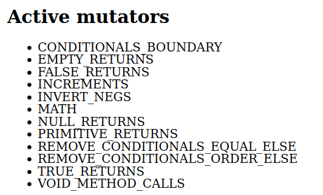

**Figure 11:** List of All Active Mutators Found in Mutation Testing

---

## 10. Mutation Coverage Interpretation

### Well-Covered Operators (60%+)

- **Empty Return Values:** 65% killed - Good coverage for default return paths
- **Null Returns:** 64% killed - Effective null handling tests
- **Boolean Returns:** 55%+ killed - Solid coverage for boolean mutations
- **Conditional Removal:** 58% killed - Good logic verification

### Weak Operators (< 50%)

- **Boundary Conditions:** 40% killed - Needs enhanced edge case tests
- **Void Method Calls:** 34% killed - Requires more state verification tests
- **Math Operations:** 0% killed - Limited arithmetic operation coverage
- **Increments:** 0% killed - Increment/decrement operations need testing

---

## 11. How to Run the Application

### Building the Project

```bash
# Clean and build the project
mvn clean package
```

### Starting the Healthcare System

```bash
# Run the application from Maven
mvn compile exec:java -Dexec.mainClass=com.healthcare.HealthcareApp
```

---

## 12. Team Contribution

### Team Member 1: Abhishek Sahu (MT2024007)

- PatientService, Patient model, PatientRepository
- PatientServiceTest 
- DateUtil, DateUtilTest 
- PrescriptionService, PrescriptionServiceTest 
- Exception handling framework
- Service layer mutation analysis, return value mutations optimization

### Team Member 2: Ankur Sinha (MT2024023)

- DoctorService, AppointmentService
- Doctor and Appointment models
- DoctorServiceTest, AppointmentServiceTest
- ValidationUtil, ValidationUtilTest 
- MedicalRecordService, MedicalRecordServiceTest 
- All 5 Repository implementations
- Integration level mutation coverage, method call analysis

---

## 13. Test Execution Flow

1. **Maven Compilation** - Source and test code compilation
2. **PIT Analysis** - Analyzes bytecode of target classes
3. **Mutation Generation** - Generates mutations based on configured mutators
4. **Test Execution** - Runs each mutation against the test suite
5. **Result Collection** - Tracks which mutations were killed
6. **Report Generation** - Creates HTML and XML reports with coverage metrics
7. **Metrics Calculation** - Computes mutation coverage and test strength

---

## 14. Conclusion

This Healthcare Management System project demonstrates the practical application of mutation testing using PIT in Java. The comprehensive test suite with 260+ test cases achieves a 75% test strength, effectively catching mutations and ensuring code quality. The mutation testing approach identified areas for improvement in test coverage and highlighted the importance of boundary condition and method call verification testing.

---

## 15. References and Resources

1. Beyond Unit Testing: Mutation Testing - https://medium.com
2. PIT Mutation Testing System - https://pitest.org
3. PIT Quick Start Guide - https://pitest.org/quickstart/mutators
4. JUnit 5 Documentation - https://junit.org/junit5/

---


